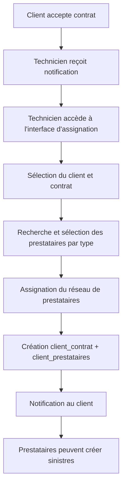

# 🏥 API - Système d'Assignation des Prestataires

Ce document explique le système d'assignation des prestataires aux clients assurés, permettant aux techniciens de créer un réseau de soins personnalisé pour chaque client.

## 📋 Table des Matières

- [Vue d'ensemble du système](#vue-densemble-du-système)
- [Workflow complet](#workflow-complet)
- [Routes API](#routes-api)
- [Assignation des prestataires](#assignation-des-prestataires)
- [Consultation des assignations](#consultation-des-assignations)
- [Gestion des prestataires](#gestion-des-prestataires)
- [Modèles de données](#modèles-de-données)
- [Codes d'erreur](#codes-derreur)

## 🔄 Vue d'ensemble du système

### Concept
Le système d'assignation permet aux **techniciens** d'assigner des **prestataires de soins** spécifiques à chaque **client** après l'acceptation de leur contrat. Cela crée un réseau de soins personnalisé pour chaque assuré.

### Acteurs principaux
- **Techniciens** : Assignent les prestataires aux clients
- **Clients** : Reçoivent un réseau de prestataires assignés
- **Prestataires** : Ne peuvent créer des sinistres que pour leurs clients assignés

### Types de prestataires
- `pharmacies` : Pharmacies et officines
- `centres_soins` : Centres de soins et cliniques
- `optiques` : Opticiens et centres optiques
- `laboratoires` : Laboratoires d'analyses médicales
- `centres_diagnostic` : Centres de diagnostic et imagerie

## 🔄 Workflow complet



---

## 🛣️ Routes API

### Routes Technicien

| Méthode | Route | Description | Rôle requis |
|---------|-------|-------------|-------------|
| `GET` | `/api/v1/technicien/clients` | Liste des clients | `technicien` |
| `GET` | `/api/v1/technicien/prestataires` | Liste des prestataires | `technicien` |
| `POST` | `/api/v1/technicien/assigner-reseau-prestataires` | Assigner prestataires | `technicien` |

### Routes Client (consultation)

| Méthode | Route | Description | Rôle requis |
|---------|-------|-------------|-------------|
| `GET` | `/api/v1/client/prestataires-assignes` | Mes prestataires | `physique`, `entreprise` |
| `GET` | `/api/v1/client/contrats-proposes` | Mes contrats proposés | `physique`, `entreprise` |

### Routes Prestataire

| Méthode | Route | Description | Rôle requis |
|---------|-------|-------------|-------------|
| `GET` | `/api/v1/prestataire/search-assures` | Clients assignés | `prestataire` |
| `GET` | `/api/v1/prestataire/sinistres` | Mes sinistres | `prestataire` |

---

## 🎯 Assignation des prestataires

### 1. Récupérer la liste des clients

**Endpoint :** `GET /api/v1/technicien/clients`

**Paramètres :**
```http
?search=Dupont&per_page=20&statut=actif
```

**Réponse :**
```json
{
  "success": true,
  "message": "Liste des clients récupérée avec succès",
  "data": {
    "current_page": 1,
    "data": [
      {
        "id": 123,
        "nom": "Dupont",
        "prenoms": "Jean Pierre",
        "email": "jean.dupont@email.com",
        "contact": "+225 07 12 34 56 78",
        "type_client": "physique",
        "contrat_accepte": {
          "id": 45,
          "type_contrat": "INDIVIDUEL",
          "statut": "ACCEPTE",
          "date_acceptation": "2025-01-08T14:30:00.000000Z"
        },
        "prestataires_assignes": false,
        "created_at": "2025-01-05T10:00:00.000000Z"
      },
      {
        "id": 456,
        "raison_sociale": "SUNU ASSURANCES SARL",
        "email": "contact@sunu-assurances.ci",
        "type_client": "entreprise",
        "contrat_accepte": {
          "id": 67,
          "type_contrat": "ENTREPRISE",
          "statut": "ACCEPTE",
          "date_acceptation": "2025-01-07T16:45:00.000000Z"
        },
        "prestataires_assignes": true,
        "nombre_employes": 25,
        "created_at": "2025-01-03T09:15:00.000000Z"
      }
    ],
    "total": 48,
    "per_page": 20,
    "current_page": 1
  }
}
```

### 2. Récupérer la liste des prestataires disponibles

**Endpoint :** `GET /api/v1/technicien/prestataires`

**Paramètres :**
```http
?type=pharmacie&search=Moderne&ville=Abidjan&statut=VALIDE
```

**Réponse :**
```json
{
  "success": true,
  "message": "Liste des prestataires récupérée avec succès",
  "data": {
    "pharmacies": [
      {
        "id": 12,
        "raison_sociale": "Pharmacie Moderne",
        "type_prestataire": "PHARMACIE",
        "adresse": "Cocody, Abidjan",
        "contact": "+225 27 22 12 34 56",
        "statut": "VALIDE",
        "distance_estimee": "2.5 km"
      }
    ],
    "centres_soins": [
      {
        "id": 34,
        "raison_sociale": "Clinique Internationale",
        "type_prestataire": "CENTRE_SOINS",
        "adresse": "Plateau, Abidjan",
        "contact": "+225 27 20 11 22 33",
        "statut": "VALIDE",
        "specialites": ["Médecine générale", "Cardiologie", "Pédiatrie"]
      }
    ],
    "optiques": [
      {
        "id": 56,
        "raison_sociale": "Optique Vision",
        "type_prestataire": "OPTIQUE",
        "adresse": "Marcory, Abidjan",
        "contact": "+225 27 21 33 44 55",
        "statut": "VALIDE"
      }
    ],
    "laboratoires": [
      {
        "id": 78,
        "raison_sociale": "Laboratoire BioMed",
        "type_prestataire": "LABORATOIRE",
        "adresse": "Treichville, Abidjan",
        "contact": "+225 27 24 55 66 77",
        "statut": "VALIDE",
        "services": ["Analyses sanguines", "Imagerie médicale"]
      }
    ]
  }
}
```

### 3. Assigner un réseau de prestataires

**Endpoint :** `POST /api/v1/technicien/assigner-reseau-prestataires`

**Payload :**
```json
{
  "client_id": 123,
  "contrat_id": 45,
  "prestataires": {
    "pharmacies": [12, 34],
    "centres_soins": [56, 78],
    "optiques": [90],
    "laboratoires": [123, 145],
    "centres_diagnostic": [167]
  }
}
```

**Réponse :**
```json
{
  "success": true,
  "message": "Réseau de prestataires assigné avec succès",
  "data": {
    "client_contrat": {
      "id": 234,
      "client_id": 123,
      "contrat_id": 45,
      "type_client": "physique",
      "date_debut": "2025-01-08T15:00:00.000000Z",
      "date_fin": "2026-01-08T15:00:00.000000Z",
      "statut": "ACTIF"
    },
    "prestataires_assignes": [
      {
        "id": 12,
        "raison_sociale": "Pharmacie Moderne",
        "type": "pharmacies",
        "adresse": "Cocody, Abidjan",
        "assignation": {
          "id": 345,
          "date_assignation": "2025-01-08T15:00:00.000000Z",
          "statut": "ACTIF"
        }
      },
      {
        "id": 56,
        "raison_sociale": "Clinique Internationale",
        "type": "centres_soins",
        "adresse": "Plateau, Abidjan",
        "assignation": {
          "id": 346,
          "date_assignation": "2025-01-08T15:00:00.000000Z",
          "statut": "ACTIF"
        }
      }
    ],
    "statistiques": {
      "total_prestataires": 7,
      "repartition": {
        "pharmacies": 2,
        "centres_soins": 2,
        "optiques": 1,
        "laboratoires": 2,
        "centres_diagnostic": 1
      }
    },
    "notifications": {
      "client_notifie": true,
      "prestataires_notifies": 7
    }
  }
}
```

---

## 👀 Consultation des assignations

### 1. Prestataires assignés d'un client (vue technicien)

**Endpoint :** `GET /api/v1/technicien/clients/{id}/prestataires`

**Réponse :**
```json
{
  "success": true,
  "message": "Prestataires assignés récupérés avec succès",
  "data": {
    "client": {
      "id": 123,
      "nom": "Dupont",
      "prenoms": "Jean Pierre",
      "type_client": "physique"
    },
    "contrat": {
      "id": 45,
      "type_contrat": "INDIVIDUEL",
      "statut": "ACTIF"
    },
    "prestataires_par_type": {
      "pharmacies": [
        {
          "id": 12,
          "raison_sociale": "Pharmacie Moderne",
          "adresse": "Cocody, Abidjan",
          "contact": "+225 27 22 12 34 56",
          "statut_assignation": "ACTIF",
          "date_assignation": "2025-01-08T15:00:00.000000Z"
        }
      ],
      "centres_soins": [
        {
          "id": 56,
          "raison_sociale": "Clinique Internationale",
          "adresse": "Plateau, Abidjan",
          "contact": "+225 27 20 11 22 33",
          "statut_assignation": "ACTIF",
          "date_assignation": "2025-01-08T15:00:00.000000Z"
        }
      ]
    },
    "statistiques": {
      "total_prestataires": 7,
      "actifs": 7,
      "inactifs": 0
    }
  }
}
```

### 2. Mes prestataires assignés (vue client)

**Endpoint :** `GET /api/v1/client/prestataires-assignes`

**Réponse :**
```json
{
  "success": true,
  "message": "Vos prestataires assignés",
  "data": {
    "contrat": {
      "id": 45,
      "type_contrat": "INDIVIDUEL",
      "couverture": 80.00,
      "date_debut": "2025-01-08T15:00:00.000000Z",
      "date_fin": "2026-01-08T15:00:00.000000Z"
    },
    "reseau_prestataires": {
      "pharmacies": [
        {
          "id": 12,
          "nom": "Pharmacie Moderne",
          "adresse": "Cocody, Abidjan",
          "contact": "+225 27 22 12 34 56",
          "horaires": "8h - 20h (Lun-Sam)",
          "services": ["Médicaments", "Conseil pharmaceutique"],
          "distance": "2.5 km"
        }
      ],
      "centres_soins": [
        {
          "id": 56,
          "nom": "Clinique Internationale",
          "adresse": "Plateau, Abidjan",
          "contact": "+225 27 20 11 22 33",
          "horaires": "24h/24 - 7j/7",
          "specialites": ["Médecine générale", "Cardiologie", "Pédiatrie"],
          "distance": "5.2 km"
        }
      ]
    },
    "informations_importantes": {
      "carte_assure_requise": true,
      "avance_frais": "Selon garanties",
      "remboursement_direct": true
    }
  }
}
```

### 3. Mes clients assignés (vue prestataire)

**Endpoint :** `GET /api/v1/prestataire/clients-assignes`

**Paramètres :**
```http
?search=Dupont&per_page=20&contrat_actif=true
```

**Réponse :**
```json
{
  "success": true,
  "message": "Vos clients assignés",
  "data": {
    "current_page": 1,
    "data": [
      {
        "id": 123,
        "nom": "Dupont",
        "prenoms": "Jean Pierre",
        "contact": "+225 07 12 34 56 78",
        "type_assure": "Assuré Principal",
        "contrat": {
          "id": 45,
          "type_contrat": "INDIVIDUEL",
          "couverture": 80.00,
          "statut": "ACTIF",
          "date_fin": "2026-01-08T15:00:00.000000Z"
        },
        "assignation": {
          "date_assignation": "2025-01-08T15:00:00.000000Z",
          "type_prestataire": "pharmacie",
          "statut": "ACTIF"
        },
        "derniere_consultation": "2025-01-05T10:30:00.000000Z",
        "nombre_sinistres": 3
      }
    ],
    "total": 156,
    "statistiques": {
      "clients_actifs": 156,
      "nouveaux_ce_mois": 12,
      "sinistres_en_cours": 8
    }
  }
}
```

---

## ⚙️ Gestion des prestataires

### 1. Modifier une assignation

**Endpoint :** `PUT /api/v1/technicien/client-prestataires/{assignation_id}`

**Payload :**
```json
{
  "statut": "INACTIF",
  "motif": "Changement de zone géographique du client",
  "date_fin": "2025-01-15T00:00:00.000000Z"
}
```

### 2. Ajouter un prestataire à un client existant

**Endpoint :** `POST /api/v1/technicien/clients/{client_id}/ajouter-prestataire`

**Payload :**
```json
{
  "prestataire_id": 234,
  "type_prestataire": "optique"
}
```

### 3. Supprimer une assignation

**Endpoint :** `DELETE /api/v1/technicien/client-prestataires/{assignation_id}`

**Payload :**
```json
{
  "motif": "Prestataire fermé définitivement"
}
```

---

## 📊 Modèles de données

### ClientContrat
```json
{
  "id": 234,
  "client_id": 123,
  "contrat_id": 45,
  "type_client": "physique|entreprise",
  "date_debut": "2025-01-08T15:00:00.000000Z",
  "date_fin": "2026-01-08T15:00:00.000000Z",
  "statut": "ACTIF|INACTIF|EXPIRE",
  "created_at": "2025-01-08T15:00:00.000000Z",
  "updated_at": "2025-01-08T15:00:00.000000Z"
}
```

### ClientPrestataire
```json
{
  "id": 345,
  "client_contrat_id": 234,
  "prestataire_id": 12,
  "type_prestataire": "pharmacie|centre_soins|optique|laboratoire|centre_diagnostic",
  "statut": "ACTIF|INACTIF",
  "date_assignation": "2025-01-08T15:00:00.000000Z",
  "date_fin": null,
  "motif_desactivation": null,
  "created_at": "2025-01-08T15:00:00.000000Z",
  "updated_at": "2025-01-08T15:00:00.000000Z"
}
```

### Prestataire
```json
{
  "id": 12,
  "user_id": 567,
  "raison_sociale": "Pharmacie Moderne",
  "type_prestataire": "PHARMACIE",
  "adresse": "Cocody, Abidjan",
  "contact": "+225 27 22 12 34 56",
  "statut": "VALIDE|EN_ATTENTE|REJETE",
  "services": ["Médicaments", "Conseil pharmaceutique"],
  "horaires": "8h - 20h (Lun-Sam)",
  "created_at": "2025-01-01T10:00:00.000000Z"
}
```

---

## ⚠️ Codes d'erreur

### Erreurs d'assignation
```json
{
  "success": false,
  "message": "Ce contrat n'appartient pas au client spécifié",
  "error_code": 400
}
```

```json
{
  "success": false,
  "message": "Prestataire ID 123 non trouvé",
  "error_code": 404
}
```

```json
{
  "success": false,
  "message": "Ce client a déjà un réseau de prestataires assigné",
  "error_code": 409
}
```

### Erreurs d'accès
```json
{
  "success": false,
  "message": "Accès non autorisé - Rôle technicien requis",
  "error_code": 403
}
```

```json
{
  "success": false,
  "message": "Cet assuré ne vous est pas assigné",
  "error_code": 403
}
```

---

## 💡 Conseils d'implémentation Frontend

### 1. Interface d'assignation (Technicien)
- **Recherche clients** : Filtrer par statut contrat, type client
- **Sélection prestataires** : Interface par onglets (pharmacies, centres, etc.)
- **Carte géographique** : Visualiser la proximité des prestataires
- **Validation** : Vérifier qu'au moins un prestataire par type essentiel

### 2. Interface client
- **Carte interactive** : Localiser les prestataires assignés
- **Filtres** : Par type, distance, services disponibles
- **Informations pratiques** : Horaires, contact, services
- **Navigation** : Intégration GPS pour directions

### 3. Interface prestataire
- **Liste clients** : Recherche, filtres par contrat
- **Profil client** : Informations contrat, garanties
- **Historique** : Consultations précédentes, sinistres
- **Notifications** : Nouveaux clients assignés

### 4. États et notifications
- **Temps réel** : WebSocket pour nouvelles assignations
- **Statuts visuels** : Indicateurs actif/inactif
- **Alertes** : Contrats expirant, changements de statut

### 5. Optimisations
- **Cache** : Listes prestataires, informations contrats
- **Pagination** : Lazy loading pour grandes listes
- **Offline** : Informations essentielles en cache local

---

## 🔧 Configuration requise

### Headers HTTP
```http
Content-Type: application/json
Accept: application/json
Authorization: Bearer {jwt_token}
```

### Permissions requises
- **Technicien** : Assignation, modification, consultation
- **Client** : Consultation de ses prestataires assignés
- **Prestataire** : Consultation de ses clients assignés

---

Ce système d'assignation garantit que chaque client dispose d'un réseau de soins adapté et que les prestataires ne peuvent traiter que leurs clients autorisés, assurant ainsi la sécurité et la traçabilité des soins.