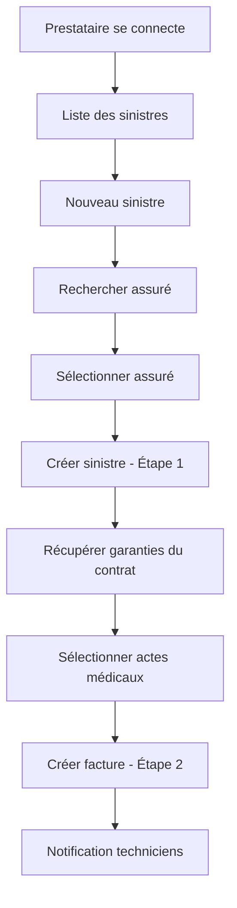
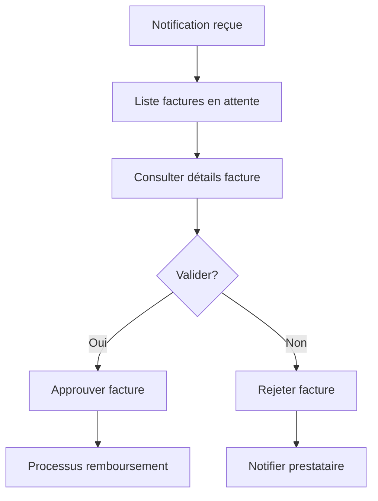

# 🏥 API Système de Gestion des Sinistres

Ce document décrit l'API complète pour le système de gestion des sinistres, permettant aux prestataires de créer des sinistres et des factures, et aux techniciens de les valider.

## 📋 Table des Matières

- [Vue d'ensemble du processus](#vue-densemble-du-processus)
- [Authentification](#authentification)
- [Routes API](#routes-api)
- [Étape 1 : Recherche et Création du Sinistre](#étape-1--recherche-et-création-du-sinistre)
- [Étape 2 : Création de la Facture](#étape-2--création-de-la-facture)
- [Gestion pour les Techniciens](#gestion-pour-les-techniciens)
- [Modèles de données](#modèles-de-données)
- [Codes d'erreur](#codes-derreur)

## 🔄 Vue d'ensemble du processus

### Système d'Assignation des Prestataires

Avant qu'un prestataire puisse créer des sinistres, il doit être assigné aux clients par un technicien :

1. **Client accepte un contrat** → Contrat devient actif
2. **Technicien assigne des prestataires** → Via `POST /api/v1/technicien/assigner-reseau-prestataires`
3. **Prestataire peut créer des sinistres** → Seulement pour les clients assignés

### Workflow pour les Prestataires



### Workflow pour les Techniciens



## 🔐 Authentification

Toutes les routes nécessitent une authentification via JWT Token :

```http
Authorization: Bearer {jwt_token}
```

**Rôles autorisés :**
- `prestataire` : Pour créer et gérer les sinistres
- `technicien` : Pour valider les factures

---

## 🛣️ Routes API

### Routes Prestataires

| Méthode | Route | Description |
|---------|-------|-------------|
| `GET` | `/api/v1/prestataire/sinistres` | Liste des sinistres |
| `POST` | `/api/v1/prestataire/sinistres` | Créer un sinistre |
| `GET` | `/api/v1/prestataire/sinistres/{id}` | Détails d'un sinistre |
| `POST` | `/api/v1/prestataire/sinistres/{id}/facture` | Créer une facture |
| `GET` | `/api/v1/prestataire/search-assures` | Rechercher des assurés |
| `GET` | `/api/v1/prestataire/contrats/{id}/garanties` | Garanties par contrat |

### Routes Techniciens

| Méthode | Route | Description |
|---------|-------|-------------|
| `GET` | `/api/v1/technicien/factures` | Liste des factures |
| `GET` | `/api/v1/technicien/factures/{id}` | Détails d'une facture |
| `POST` | `/api/v1/technicien/factures/{id}/valider` | Valider une facture |
| `POST` | `/api/v1/technicien/factures/{id}/rejeter` | Rejeter une facture |

---

## 🔍 Étape 1 : Recherche et Création du Sinistre

### 1.1 Recherche d'Assurés

**Endpoint :** `GET /api/v1/prestataire/search-assures`

**Important :** Un prestataire ne peut voir que les assurés qui lui ont été assignés par un technicien via le système d'assignation de réseau de prestataires.

**Paramètres :**
```http
?search=Jean&per_page=10
```

**Réponse :**
```json
{
  "success": true,
  "message": "Assurés assignés trouvés",
  "data": [
    {
      "id": 123,
      "nom": "Dupont",
      "prenoms": "Jean Pierre",
      "email": "jean.dupont@email.com",
      "contact": "+225 07 12 34 56 78",
      "type_assure": "Employé - SUNU ASSURANCES",
      "est_principal": false,
      "contrat": {
        "id": 45,
        "type_contrat": "ENTREPRISE",
        "est_actif": true,
        "statut": "ACTIF"
      }
    }
  ]
}
```

### 1.2 Créer un Sinistre

**Endpoint :** `POST /api/v1/prestataire/sinistres`

**Payload :**
```json
{
  "assure_id": 123,
  "description": "Consultation médicale pour grippe"
}
```

**Réponse :**
```json
{
  "success": true,
  "message": "Sinistre créé avec succès",
  "data": {
    "id": 456,
    "description": "Consultation médicale pour grippe",
    "date_sinistre": "2025-01-08",
    "statut": "DECLARE",
    "statut_libelle": "Déclaré",
    "assure": {
      "id": 123,
      "nom": "Dupont",
      "prenoms": "Jean Pierre",
      "email": "jean.dupont@email.com",
      "contact": "+225 07 12 34 56 78",
      "est_principal": false,
      "type_assure": "Employé - SUNU ASSURANCES",
      "contrat": {
        "id": 45,
        "type_contrat": "ENTREPRISE",
        "est_actif": true
      }
    },
    "created_at": "2025-01-08T10:30:00.000000Z"
  }
}
```

---

## 💊 Étape 2 : Création de la Facture

### 2.1 Récupérer les Garanties du Contrat

**Endpoint :** `GET /api/v1/prestataire/contrats/{contrat_id}/garanties`

**Réponse :**
```json
{
  "success": true,
  "message": "Garanties récupérées avec succès",
  "data": [
    {
      "id": 78,
      "libelle": "Consultation médicale générale",
      "prix_standard": 15000.00,
      "taux_couverture": 80.00,
      "plafond": 50000.00,
      "categorie": {
        "id": 12,
        "libelle": "Soins ambulatoires",
        "couverture": 80.00
      }
    },
    {
      "id": 79,
      "libelle": "Prescription et délivrance médicaments",
      "prix_standard": 25000.00,
      "taux_couverture": 70.00,
      "plafond": 100000.00,
      "categorie": {
        "id": 13,
        "libelle": "Pharmacie",
        "couverture": 70.00
      }
    }
  ]
}
```

### 2.2 Créer la Facture

**Endpoint :** `POST /api/v1/prestataire/sinistres/{sinistre_id}/facture`

**Payload :**
```json
{
  "diagnostic": "Grippe saisonnière avec complications respiratoires",
  "lignes_facture": [
    {
      "garantie_id": 78,
      "libelle_acte": "Consultation médicale générale",
      "quantite": 1
    },
    {
      "garantie_id": 79,
      "libelle_acte": "Prescription antibiotiques et anti-inflammatoires",
      "quantite": 1
    }
  ],
  "photo_justificatifs": [
    "uploads/factures/ordonnance_123.jpg",
    "uploads/factures/certificat_medical_123.pdf"
  ]
}
```

**Réponse :**
```json
{
  "success": true,
  "message": "Facture créée avec succès",
  "data": {
    "id": 789,
    "numero_facture": "FAC-2025-0001-000789",
    "sinistre_id": 456,
    "prestataire_id": 12,
    "montant_reclame": 40000.00,
    "montant_a_rembourser": 30500.00,
    "diagnostic": "Grippe saisonnière avec complications respiratoires",
    "photo_justificatifs": [
      "uploads/factures/ordonnance_123.jpg",
      "uploads/factures/certificat_medical_123.pdf"
    ],
    "ticket_moderateur": 9500.00,
    "statut": "EN_ATTENTE",
    "statut_libelle": "En attente de validation",
    "lignes_facture": [
      {
        "id": 1001,
        "libelle_acte": "Consultation médicale générale",
        "prix_unitaire": 15000.00,
        "quantite": 1,
        "prix_total": 15000.00,
        "taux_couverture": 80.00,
        "montant_couvert": 12000.00,
        "ticket_moderateur": 3000.00,
        "garantie": {
          "id": 78,
          "libelle": "Consultation médicale générale",
          "prix_standard": 15000.00,
          "plafond": 50000.00,
          "categorie_garantie": {
            "id": 12,
            "libelle": "Soins ambulatoires"
          }
        }
      },
      {
        "id": 1002,
        "libelle_acte": "Prescription antibiotiques et anti-inflammatoires",
        "prix_unitaire": 25000.00,
        "quantite": 1,
        "prix_total": 25000.00,
        "taux_couverture": 70.00,
        "montant_couvert": 17500.00,
        "ticket_moderateur": 7500.00,
        "garantie": {
          "id": 79,
          "libelle": "Prescription et délivrance médicaments",
          "prix_standard": 25000.00,
          "plafond": 100000.00,
          "categorie_garantie": {
            "id": 13,
            "libelle": "Pharmacie"
          }
        }
      }
    ],
    "created_at": "2025-01-08T11:15:00.000000Z"
  }
}
```

---

## 👨‍💼 Gestion pour les Techniciens

### 3.1 Liste des Factures en Attente

**Endpoint :** `GET /api/v1/technicien/factures`

**Paramètres :**
```http
?statut=EN_ATTENTE&per_page=20&search=Dupont
```

**Réponse :**
```json
{
  "success": true,
  "message": "Liste des factures récupérée avec succès",
  "data": {
    "current_page": 1,
    "data": [
      {
        "id": 789,
        "numero_facture": "FAC-2025-0001-000789",
        "montant_reclame": 40000.00,
        "montant_a_rembourser": 30500.00,
        "statut": "EN_ATTENTE",
        "statut_libelle": "En attente de validation",
        "sinistre": {
          "id": 456,
          "description": "Consultation médicale pour grippe",
          "date_sinistre": "2025-01-08",
          "assure": {
            "id": 123,
            "nom": "Dupont",
            "prenoms": "Jean Pierre",
            "est_principal": false
          }
        },
        "prestataire": {
          "id": 12,
          "raison_sociale": "Clinique Moderne",
          "type_prestataire": "CENTRE_SOINS"
        },
        "created_at": "2025-01-08T11:15:00.000000Z"
      }
    ],
    "total": 15,
    "per_page": 20,
    "current_page": 1,
    "last_page": 1
  }
}
```

### 3.2 Détails d'une Facture

**Endpoint :** `GET /api/v1/technicien/factures/{id}`

**Réponse :** (Même structure que la création de facture avec tous les détails)

### 3.3 Valider une Facture

**Endpoint :** `POST /api/v1/technicien/factures/{id}/valider`

**Payload :**
```json
{
  "commentaire": "Facture conforme, validation accordée"
}
```

**Réponse :**
```json
{
  "success": true,
  "message": "Facture validée avec succès",
  "data": {
    "id": 789,
    "statut": "VALIDEE_TECHNICIEN",
    "est_valide_par_technicien": true,
    "valide_par_technicien_a": "2025-01-08T14:30:00.000000Z"
  }
}
```

### 3.4 Rejeter une Facture

**Endpoint :** `POST /api/v1/technicien/factures/{id}/rejeter`

**Payload :**
```json
{
  "motif_rejet": "Documents justificatifs insuffisants. Veuillez fournir l'ordonnance complète."
}
```

**Réponse :**
```json
{
  "success": true,
  "message": "Facture rejetée",
  "data": {
    "id": 789,
    "statut": "REJETEE",
    "motif_rejet": "Documents justificatifs insuffisants. Veuillez fournir l'ordonnance complète."
  }
}
```

---

## 📊 Modèles de Données

### Sinistre
```json
{
  "id": 456,
  "description": "string",
  "date_sinistre": "2025-01-08",
  "statut": "DECLARE|EN_COURS|TRAITE|CLOTURE",
  "statut_libelle": "string",
  "assure_id": 123,
  "prestataire_id": 12,
  "created_at": "datetime",
  "updated_at": "datetime"
}
```

### Facture
```json
{
  "id": 789,
  "numero_facture": "FAC-2025-0001-000789",
  "sinistre_id": 456,
  "prestataire_id": 12,
  "montant_reclame": 40000.00,
  "montant_a_rembourser": 30500.00,
  "diagnostic": "string",
  "photo_justificatifs": ["array of file paths"],
  "ticket_moderateur": 9500.00,
  "statut": "EN_ATTENTE|VALIDEE_TECHNICIEN|VALIDEE_MEDECIN|AUTORISEE_COMPTABLE|REMBOURSEE|REJETEE",
  "motif_rejet": "string|null",
  "created_at": "datetime",
  "updated_at": "datetime"
}
```

### Ligne Facture
```json
{
  "id": 1001,
  "facture_id": 789,
  "garantie_id": 78,
  "libelle_acte": "string",
  "prix_unitaire": 15000.00,
  "quantite": 1,
  "prix_total": 15000.00,
  "taux_couverture": 80.00,
  "montant_couvert": 12000.00,
  "ticket_moderateur": 3000.00
}
```

### Assuré
```json
{
  "id": 123,
  "nom": "string",
  "prenoms": "string",
  "email": "string",
  "contact": "string",
  "type_assure": "Employé - Entreprise|Assuré Principal|Bénéficiaire",
  "est_principal": boolean,
  "contrat": {
    "id": 45,
    "type_contrat": "string",
    "est_actif": boolean,
    "statut": "string"
  }
}
```

---

## ⚠️ Codes d'Erreur

### Erreurs Communes
- `400` - Données invalides ou contrat inactif
- `401` - Non authentifié
- `403` - Accès refusé (rôle insuffisant)
- `404` - Ressource non trouvée
- `422` - Erreur de validation
- `500` - Erreur serveur

### Messages d'Erreur Spécifiques

```json
{
  "success": false,
  "message": "Vous n'êtes pas un prestataire",
  "error_code": 403
}
```

```json
{
  "success": false,
  "message": "L'assuré n'a pas de contrat actif",
  "error_code": 400
}
```

```json
{
  "success": false,
  "message": "Contrat non trouvé",
  "error_code": 404
}
```

```json
{
  "success": false,
  "message": "Cet assuré ne vous est pas assigné",
  "error_code": 403
}
```

```json
{
  "success": false,
  "message": "Aucun client ne vous est assigné",
  "error_code": 200
}
```

---

## 💡 Conseils d'Implémentation Frontend

### 1. Interface de Recherche d'Assurés
- Utiliser un champ de saisie avec autocomplétion
- Afficher minimum 2 caractères avant de déclencher la recherche
- Montrer le type d'assuré et le statut du contrat
- Désactiver la sélection si le contrat n'est pas actif

### 2. Sélection des Garanties
- Afficher les garanties par catégorie
- Montrer le prix standard et le taux de couverture
- Calculer en temps réel le montant couvert et le ticket modérateur
- Permettre la sélection multiple avec quantités

### 3. Gestion des États
- Sauvegarder l'état entre les étapes
- Permettre de revenir à l'étape précédente
- Afficher un résumé avant validation finale
- Gérer les erreurs avec messages explicites

### 4. Upload de Fichiers
- Supporter les formats : JPG, PNG, PDF
- Taille maximum : 5MB par fichier
- Prévisualisation des images
- Validation côté client avant upload

### 5. Notifications en Temps Réel
- Implémenter WebSocket ou Server-Sent Events pour les notifications
- Afficher les nouvelles factures en attente pour les techniciens
- Mettre à jour automatiquement les statuts

---

## 🔧 Configuration Requise

### Headers HTTP
```http
Content-Type: application/json
Accept: application/json
Authorization: Bearer {jwt_token}
```

### Variables d'Environnement
```env
APP_URL=https://votre-domaine.com
MAIL_FROM_ADDRESS=noreply@votre-domaine.com
QUEUE_CONNECTION=database  # Pour les notifications
```

---

Cette documentation couvre l'ensemble du système de sinistres. Pour toute question ou clarification, contactez l'équipe backend.